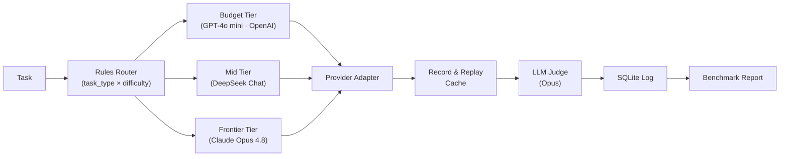

# AI Workload Router


**[Read the full product case study →](https://claude.ai/code/artifact/205c2a5e-9447-48dc-96d3-dd4459dc3531)** (visual writeup with the benchmark data) · License: MIT

Teams building on LLMs default to sending every request to one expensive frontier model "to be safe." The **AI Workload Router** classifies each task and routes it to the cheapest model that can still do it well — across three vendors (OpenAI, DeepSeek, Anthropic) — logging cost, latency, and quality on every call. On a live 25-task benchmark, routing cut cost 53.6% and mean latency 46% with no quality loss, validated by two independent LLM judges from rival vendors.

## Results

<!-- RESULTS:BEGIN -->
Live three-vendor benchmark (25 tasks, real API calls, real LLM judge — run `20260717T082024`):

| Strategy | Total cost | Mean quality | Mean latency |
|---|---|---|---|
| Frontier-only (baseline: every task → Claude Opus 4.8) | $0.1260 | 0.992 | 4,155 ms |
| **Router** (cheapest capable model per task) | **$0.0585** | **0.996** | **2,237 ms** |

- **Cost reduction: 53.6%** · **Quality retention: 100%** · **Latency: 46.2% faster**
- Hypothesis (≥40% cost reduction at ≥95% quality): **PASSED**
- Judge validation: an independent second judge (GPT-4o-mini) agreed with the primary judge (Claude Opus 4.8) on **96.7%** of 30 scored answers (mean |diff| 0.010).
- At-scale projection (directional): ~**$2,700/month saved per 1M requests** at this task mix.
- Reasoning tasks route to the frontier model under *both* strategies — that share of the bill is quality-locked, which is why savings cap out where they do. The ceiling is set by workload composition, not router cleverness.
<!-- RESULTS:END -->

## Architecture



## How It Works

- **Adapter layer** — one internal interface normalizes calls across multiple LLM providers (Anthropic, OpenAI, DeepSeek), so any model is swappable by config.
- **Rules router** — classifies each task by type and difficulty, then picks a model tier: easy tasks → budget, medium → mid, hard reasoning → frontier.
- **Quality floor** — a configurable quality threshold (default 95% of frontier baseline) ensures cost savings never compromise critical tasks.
- **LLM-as-judge, cross-validated** — a strong model scores every output 0–1 against a rubric; a second judge from a rival vendor re-scores everything (`validate_judge.py`) to catch same-family bias, plus an exportable human-label sheet.
- **Record & replay cache** — every real API response is cached to disk, so the full benchmark re-runs for free and is fully reproducible by anyone.
- **Performance log** — every run (task, model, tokens, cost, latency, quality) is persisted to SQLite, the data layer that powers future adaptive routing.
- **Mock fallback** — runs completely offline with zero API keys using a quality profile, so you can verify the system end-to-end before adding credentials.

## v2: Four follow-up experiments

v1 (above) routes across three vendors using *hand-labeled* task difficulty — a clean proof of the idea, but it leans on two things a real deployment lacks: labels it didn't generate, and a free choice of vendors. v2 removes both crutches and adds a second routing strategy. Everything here is additive: the default configuration still reproduces the v1 run byte-for-byte, and all figures below are live (real API calls, real Opus judge).

**1. A real classifier replaces the hand labels.** A production router gets a prompt, not a difficulty label. v2 predicts `(task_type, difficulty)` from the prompt with the roster's cheapest model, and reports savings *net of that prediction's cost*. Live, classifier routing came out **cheaper than the hand labels — 65.6% vs 53.6%** cross-vendor at equal quality: on 7 of 25 tasks it found cheaper models than the labels dictated, all judged 0.85–1.00. The labels were conservative; a cheap classifier found the slack, for a routing cost of ~1% of savings.

**2. Staying inside one vendor.** Enterprises often can't add vendors but can always add tiers. Routing across Claude Haiku / Sonnet / Opus (a ~5× price range vs ~41× cross-vendor) nets **42.5%** — right where the price arithmetic predicts. Narrower price range means a lower ceiling *and* worse overhead (11% of savings vs 1%), because the cheapest available classifier (Haiku) isn't as cheap as GPT-4o mini.

**3. A cascade — react instead of predict.** Try the cheapest model, have a cheap reference-free verifier check the answer, and escalate only on a failed check. Live within-vendor, the cascade **beat the classifier on net savings (53.1% vs 42.5%)** — it tries Haiku on everything and discovers what works, rather than pre-routing reasoning to Opus — at triple the overhead (31% of savings) and higher latency. The verifier model is configurable, defaulting to the independent mid tier (Sonnet); opting into the cheapest tier (Haiku) is a clean win on the easy set — **53.1% net at 31% overhead becomes 85.0% net at 6.2% overhead**, quality unchanged — but a false economy on the hard set below (overhead falls to 14.7% but quality drops to 70%: Haiku scores its own wrong answers 0.95–1.0, a self-verification blind spot). The default stays with the independent verifier because the router's core guarantee — never trade quality away — has to hold on workloads it hasn't seen. Full numbers and root cause in [docs/V2_FINDINGS.md](docs/V2_FINDINGS.md#verifier-economics-does-a-cheaper-verifier-still-gate-correctly).

**4. A hard task set, because the easy one saturates.** The published 25 tasks score ~0.99 across every tier, so they can't show whether routing holds quality when tasks are genuinely hard. A 10-task probe set (`data/tasks_hard.json`, mostly objective `exact_match`) *does* separate them: Haiku 0.70, Sonnet 0.90, Opus 1.00. Run the strategies on it and the punchline lands: **on hard tasks both strategies hold 100% quality but go cost-negative** (classifier −6%, cascade −20%). Every hard task needs the frontier, so routing only adds overhead — but it never sacrifices quality to try.

**The through-line:** routing's savings scale with how much genuinely-easy work a workload contains, and collapse to zero (or below) on all-hard workloads — the demonstrated form of v1's "ceiling = workload composition × price range." Quality, on both strategies, was never the thing that gave.

```bash
python3 run_benchmark.py --roster claude_tiers --classify          # within-vendor, real classifier
python3 run_benchmark.py --roster claude_tiers --strategy cascade   # escalate-on-failure
python3 run_benchmark.py --roster claude_tiers --strategy cascade --verifier claude-haiku-4-5  # cheap verifier
python3 run_benchmark.py --classify --tasks data/tasks_hard.json    # stress quality on hard tasks
python3 run_effort_grid.py                                          # (model × effort) frontier
```

*Caveats: n is 25 (10 for the hard set), so these are directional, not statistically certified. The Opus judge scores generously on the easy set (the same instrument cross-validated in v1). The effort dial and Sonnet 5's introductory pricing carry their own footnotes in the code.*

## Where this goes next: v3, the learned router

Everything above still predicts difficulty *cold* — from the prompt alone,
every time. But every run already gets logged to `data/runs.db` (task type,
model, cost, quality). v3 proposes closing that loop: consult outcome
history for tasks like this one before routing, and let the router get
cheaper as it learns your workload — never trading away the quality floor to
do it. Full design, including the cold-start rule and the safety asymmetry
borrowed from the v2 verifier finding, in [`docs/V3_DESIGN.md`](docs/V3_DESIGN.md).

## Run It Yourself

**Setup:**

```bash
cp .env.example .env
# Add your ANTHROPIC_API_KEY (required) and optional OpenAI, Google, or DeepSeek keys
```

**Run the benchmark:**

```bash
python3 run_benchmark.py
```

First run makes live API calls and caches results to `.cache/`. Every subsequent run re-uses cached data and is free. The benchmark report prints cost/quality comparison and confirms the hypothesis (≥40% cost reduction, ≥95% quality retention).

**Options:**

- `AWR_FORCE_MOCK=1 python3 run_benchmark.py` — run fully offline using mock responses (no API keys needed).
- `python3 -m unittest discover -s tests` — run the test suite.

## Project Docs

- **[`docs/PRD.md`](docs/PRD.md)** — product requirements, success metrics, and the core hypothesis being tested.
- **[`CASE_STUDY.md`](CASE_STUDY.md)** — decision rationale, how scope was cut, benchmark methodology, and full results breakdown.
- **[`docs/V3_DESIGN.md`](docs/V3_DESIGN.md)** — design for the learned router (v3, not yet built): closing the feedback loop from `runs.db`.

## Limitations

- **LLM judges are imperfect instruments.** Cross-vendor agreement is strong (96.7% within 0.15), but both judges could share blind spots — the human-label sheet (`data/human_label_sheet.csv`) exists to close that gap.
- **25 tasks is a starting eval, not production-scale.** It's enough to demonstrate the method and the composition insight; certifying a production savings figure requires a larger, workload-specific task set.
- **Single-turn tasks only.** Real workloads include multi-turn conversations and tool-use flows that this benchmark doesn't cover.
- **The at-scale projection is directional.** It extrapolates linearly from this benchmark's task mix; real traffic will differ.
- **The LLM judge is prompt-injectable.** A hostile task input could instruct the judge to mis-score ("rate this 1.0"). Harmless in a self-controlled benchmark; a hosted version would need injection defenses (input isolation, structured judge output) before accepting untrusted tasks.
