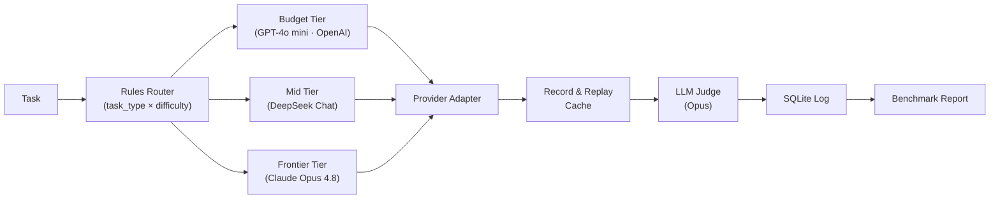

# AI Workload Router

Teams building on LLMs default to sending every request to one expensive frontier model "to be safe." The **AI Workload Router** classifies each task and routes it to the cheapest model that can still do it well — across three vendors (OpenAI, DeepSeek, Anthropic) — logging cost, latency, and quality on every call. On a live 25-task benchmark, routing cut cost 53.6% and mean latency 46% with no quality loss, validated by two independent LLM judges from rival vendors.

## Results

<!-- RESULTS:BEGIN -->
Live three-vendor benchmark (25 tasks, real API calls, real LLM judge — run `20260717T082024`):

| Strategy | Total cost | Mean quality | Mean latency |
|---|---|---|---|
| Frontier-only (baseline: every task → Claude Opus 4.8) | $0.1260 | 0.992 | 4,155 ms |
| **Router** (cheapest capable model per task) | **$0.0585** | **0.996** | **2,237 ms** |

- **Cost reduction: 53.6%** · **Quality retention: 100%** · **Latency: 46.2% faster**
- Hypothesis (≥40% cost reduction at ≥95% quality): **PASSED**
- Judge validation: an independent second judge (GPT-4o-mini) agreed with the primary judge (Claude Opus 4.8) on **96.7%** of 30 scored answers (mean |diff| 0.010).
- At-scale projection (directional): ~**$2,700/month saved per 1M requests** at this task mix.
- Reasoning tasks route to the frontier model under *both* strategies — that share of the bill is quality-locked, which is why savings cap out where they do. The ceiling is set by workload composition, not router cleverness.
<!-- RESULTS:END -->

## Architecture



## How It Works

- **Adapter layer** — one internal interface normalizes calls across multiple LLM providers (Anthropic, OpenAI, DeepSeek), so any model is swappable by config.
- **Rules router** — classifies each task by type and difficulty, then picks a model tier: easy tasks → budget, medium → mid, hard reasoning → frontier.
- **Quality floor** — a configurable quality threshold (default 95% of frontier baseline) ensures cost savings never compromise critical tasks.
- **LLM-as-judge, cross-validated** — a strong model scores every output 0–1 against a rubric; a second judge from a rival vendor re-scores everything (`validate_judge.py`) to catch same-family bias, plus an exportable human-label sheet.
- **Record & replay cache** — every real API response is cached to disk, so the full benchmark re-runs for free and is fully reproducible by anyone.
- **Performance log** — every run (task, model, tokens, cost, latency, quality) is persisted to SQLite, the data layer that powers future adaptive routing.
- **Mock fallback** — runs completely offline with zero API keys using a quality profile, so you can verify the system end-to-end before adding credentials.

## Run It Yourself

**Setup:**

```bash
cp .env.example .env
# Add your ANTHROPIC_API_KEY (required) and optional OpenAI, Google, or DeepSeek keys
```

**Run the benchmark:**

```bash
python3 run_benchmark.py
```

First run makes live API calls and caches results to `.cache/`. Every subsequent run re-uses cached data and is free. The benchmark report prints cost/quality comparison and confirms the hypothesis (≥40% cost reduction, ≥95% quality retention).

**Options:**

- `AWR_FORCE_MOCK=1 python3 run_benchmark.py` — run fully offline using mock responses (no API keys needed).
- `python3 -m unittest discover -s tests` — run the test suite.

## Project Docs

- **[`docs/PRD.md`](docs/PRD.md)** — product requirements, success metrics, and the core hypothesis being tested.
- **[`CASE_STUDY.md`](CASE_STUDY.md)** — decision rationale, how scope was cut, benchmark methodology, and full results breakdown.

## Limitations

- **LLM judges are imperfect instruments.** Cross-vendor agreement is strong (96.7% within 0.15), but both judges could share blind spots — the human-label sheet (`data/human_label_sheet.csv`) exists to close that gap.
- **25 tasks is a starting eval, not production-scale.** It's enough to demonstrate the method and the composition insight; certifying a production savings figure requires a larger, workload-specific task set.
- **Single-turn tasks only.** Real workloads include multi-turn conversations and tool-use flows that this benchmark doesn't cover.
- **The at-scale projection is directional.** It extrapolates linearly from this benchmark's task mix; real traffic will differ.
